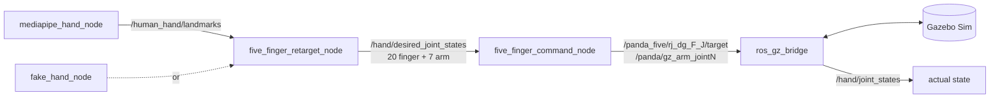

# 4 · Simulation and ROS graph

## The robot model

`scripts/build_panda_five_model.py` builds a single Gazebo model, `panda_five`, from two vendored, BSD-licensed sources:

- the **Franka Panda** arm, with its two-finger gripper removed;
- the **Tesollo DG-5F** five-finger hand (URDF converted with `gz sdf -p`), fixed to the Panda flange.

It also adds a position controller for every joint. Rerun the script after changing its inputs, then rebuild the ROS package (`run_live.sh` does both).

## Joint control

Every joint uses Gazebo's `JointPositionController` in **velocity-command mode**: at each step the joint is commanded a speed proportional to its remaining error. Unlike torque control, this doesn't overshoot on the light finger links and doesn't sag under the hand's weight.

| Joints | Gain | Speed limit |
| --- | --- | --- |
| 20 finger joints | 12 /s | ±4 rad/s |
| 7 arm joints | 6 /s | ±2 rad/s |

Measured headless with the synthetic hand, the fingers stay within 0.01 rad of their targets once the arm has settled.

## ROS graph

| Topic | Type | Meaning |
| --- | --- | --- |
| `/human_hand/landmarks` | `Float32MultiArray` | 21 × (x, y, z) from the camera |
| `/hand/desired_joint_states` | `JointState` | Smoothed targets: 20 finger + 7 arm joints |
| `/hand/joint_states` | `JointState` | Actual joint positions from Gazebo |

## Scene

The world has a shadow-casting key light, a fill light and a rim light. The GUI camera is framed close on the raised hand, and a small table with a red cube stands in front for the (disabled) grab mode.

← Back to the [overview](README.md)
