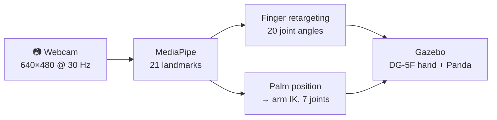

# How the hand tracking works

A webcam watches your hand. A robot hand on a Franka Panda arm in Gazebo copies it: **each finger bends with yours**, and **the arm follows your hand** as it moves around the frame.

| Step | What happens | Read more |
| --- | --- | --- |
| 1. See | MediaPipe finds 21 3D landmarks on your hand in every camera frame. | [Camera and landmarks](01-landmarks.md) |
| 2. Bend | Angles between landmark segments become the 20 finger joint angles. | [Finger retargeting](02-finger-retargeting.md) |
| 3. Follow | Where your palm is in the image sets where the robot hand goes; inverse kinematics solves the arm. | [Arm following](03-arm-following.md) |
| 4. Move | Gazebo controllers drive every joint to its target, and the ROS graph ties it together. | [Simulation and ROS graph](04-simulation.md) |

**Try it:** `./run_live.sh` from the repository root (setup in the [main README](../README.md)).
